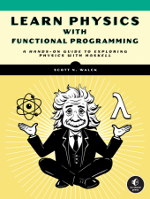

# Learn Physics With Functional Programming
### Personal Study Guide



This repository contains my solutions and notes for exercises from the book "Learn Physics With Functional Programming" by Scott N. Walck.


## Repository Structure

The solutions are organized by chapters, corresponding to the book's structure. Each chapter has its own module in the `src/LPFP/` directory.

```
learn-physics-haskell/
├── app/
│   └── lpfp-ch02.hs
├── src/
│   └── LPFP/
│       └── Ch02.hs
├── CHANGELOG.md
├── README.md
└── learn-physics-haskell.cabal
```

## How to Use This Repository

1. Clone the repository
2. Ensure you have GHC (Glasgow Haskell Compiler) and Cabal installed
3. Navigate to the project directory
4. Run `cabal build` to compile the project
5. Run `cabal run lpfp-ch02` to execute the solutions for Chapter 2

## Disclaimer and Purpose

This repository contains my personal study notes and exercise solutions. It is intended as a personal learning journal, and a potential resource for other learners.

This is not an official solution guide or affiliated with the book's author or publisher. All content is my own interpretation and work, created for educational purposes.

As this repository represents my personal learning journey, I'm not actively seeking contributions. However, if you spot an error or have a suggestion, feel free to open an issue for discussion.
